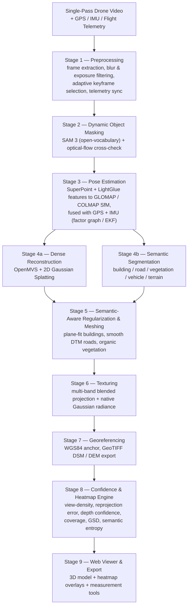
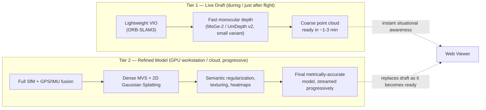
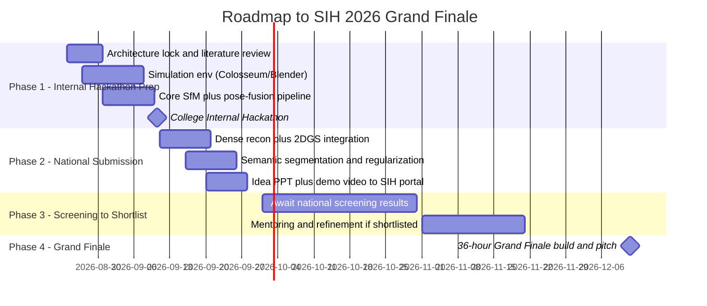

# PS 26158 — Single-Pass Drone Video → Accurate 3D Model Generation
## Technical Blueprint & Execution Plan — SIH 2026 (NTRO)

> **Team Name:** _[fill in]_
> **Prepared:** 23 Aug 2026 &nbsp;·&nbsp; **PS ID:** 26158 &nbsp;·&nbsp; **Organization:** National Technical Research Organisation (NTRO) &nbsp;·&nbsp; **Theme:** Robotics and Drones &nbsp;·&nbsp; **Category:** Software

**The Team**

| Member | Strength (as given) | Primary Lane in This Plan |
|---|---|---|
| Ansh | Mech / Hardware / CAD / Embedded | Drone rig, telemetry hardware, camera calibration, CAD mounts |
| Amatra | Product / UX / Pitch | Judge narrative, viewer UX, PPT + demo video |
| Naman | Backend | Orchestration service, APIs, storage, integration, deployment |
| Avni | Junior Python / Embedded | Preprocessing scripts, dataset wrangling, QA, embedded support |
| Kinshuk | CV / ML / Simulation | SfM/SLAM, MVS, dynamic-object detection, simulation environment |
| Rishav | AI/ML / R&D | Neural rendering (Gaussian Splatting), depth models, regularization, heatmaps |

---

## Table of Contents
1. [TL;DR](#1-tldr)
2. [Reading the Problem Statement Correctly](#2-reading-the-problem-statement-correctly)
3. [Our Core Idea](#3-our-core-idea)
4. [Challenge → Solution Traceability](#4-challenge--solution-traceability)
5. [System Architecture](#5-system-architecture)
6. [The Pipeline, Stage by Stage](#6-the-pipeline-stage-by-stage)
7. [Making the Shapes "Perfect": Semantic-Aware Regularization](#7-making-the-shapes-perfect-semantic-aware-regularization)
8. [Heatmaps & Confidence Layers](#8-heatmaps--confidence-layers)
9. [Two-Tier Real-Time Architecture](#9-two-tier-real-time-architecture)
10. [Tech Stack](#10-tech-stack)
11. [Datasets & the Simulation Strategy](#11-datasets--the-simulation-strategy)
12. [Evaluation: How We'll Know It's Good](#12-evaluation-how-well-know-its-good)
13. [Team Roles, In Detail](#13-team-roles-in-detail)
14. [Timeline: Now → Grand Finale](#14-timeline-now--grand-finale)
15. [Risk Mitigation & Demo Fallbacks](#15-risk-mitigation--demo-fallbacks)
16. [Why This Wins](#16-why-this-wins)
17. [Future Scope](#17-future-scope)
18. [This Week's Action Items](#18-this-weeks-action-items)
19. [References & Further Reading](#19-references--further-reading)

---

## 1. TL;DR

**The one-liner:** We don't just turn a drone video into a point cloud — we turn it into a *scene the system understands*. GPS/IMU-anchored visual pose estimation gives us real-world metric scale without relying on Ground Control Points (GCPs); a neural-rendering core (2D Gaussian Splatting) gives us photoreal, fast, geometrically-accurate reconstruction; a semantic layer tells buildings apart from roads apart from trees apart from cars, so **each class gets the geometric treatment it deserves** — crisp regularized planes for facades and roofs, smooth surfaces for roads, organic detail for vegetation; and every single part of the output carries a **confidence/heatmap layer** so an operator instantly knows what to trust and what needs a second flight.

**Important scheduling note before anything else:** PS 26158 was published on **21 Aug 2026** as part of the SIH 2026 launch. Per the standard SIH cadence, your **college-level Internal Hackathon happens in September 2026** — that is the first real deadline, not the December Grand Finale. You need a working, demo-able proof of concept **weeks from now**, not months. Section 14 lays this out precisely.

**Six things that differentiate this solution:**
1. **Sensor-fused pose estimation** (GPS + IMU + vision) for metric accuracy without extensive GCPs — the same principle commercial photogrammetry suites use, but built by us and adapted to single-pass video.
2. **Semantic-aware reconstruction** — different object classes get different, appropriate geometric treatment. This is *how* we get "perfect," clean shapes instead of noisy blobs.
3. **Honest occlusion handling** — unseen surfaces are flagged in a confidence map, never silently invented. For a reconnaissance-adjacent use case, a model that admits what it doesn't know is more trustworthy than one that hallucinates.
4. **A full confidence/heatmap system** — view-density, depth confidence, reprojection error, coverage gaps, resolution, all exportable as both interactive overlays and standalone 2D texture images.
5. **Two-tier processing** — a coarse model in minutes for immediate situational awareness, a refined metrically-accurate model progressively behind it.
6. **A simulation environment as a first-class deliverable**, not an afterthought — it gives the team unlimited free test data *with perfect ground truth*, which is otherwise impossible to get without expensive laser scanning, and lets you demonstrate robustness against every challenge NTRO explicitly listed, on command, in the demo.

---

## 2. Reading the Problem Statement Correctly

**What NTRO is actually asking for**, condensed from the PS:
- Input: one continuous drone flight video (1080p/4K) + GPS + flight metadata (mandatory); optionally IMU, barometric altitude, camera intrinsics, RTK/PPK.
- Output: a georeferenced, metrically accurate 3D reconstruction covering terrain/structures, building facades/roofs, roads/infrastructure, vegetation/obstacles — as textured meshes or point clouds — usable for **visualization, measurement, and analysis**.
- Eight explicit challenges (Section 4 addresses each one directly).
- Applications span disaster response, border/strategic mapping, urban planning, construction monitoring, archaeology, digital twins, and military reconnaissance — i.e., this is a **general-purpose aerial reconstruction engine**, not a narrow tool. Design for the general case; the "military" framing is one deployment context among many equally valid civilian ones.

**A note on the missing table:** The PS screenshot (and the official SIH 2026 problem-statement compilation) both show a placeholder — *"Add 'Desired Output' and 'Evaluation Criteria' table here"* — that was never filled in by the submitting organization. This isn't unique to PS 26158; several other PS in the same 2026 batch have identical unfilled placeholders. **NTRO has not published a scoring rubric for this PS.** Rather than treat that as a gap, treat it as an opening: Section 12 proposes our own rigorous evaluation rubric. Presenting a self-imposed measurement standard, backed by numbers, is a strong signal to judges that the team understands engineering quality isn't just "does it look cool."

---

## 3. Our Core Idea

Think of the pipeline as answering four questions about the scene, in order:

1. **Where was the camera, exactly, at every frame?** (pose estimation, metrically anchored)
2. **What does the surface in front of it look like?** (dense geometry — classical + neural)
3. **What *kind* of surface is it?** (semantics — building vs. road vs. vegetation vs. car)
4. **How sure are we?** (confidence, everywhere, always visible)

Everything else in this document is detail in service of those four questions. The reason this framing matters for the pitch: most naive answers to this PS stop at question 2 (run COLMAP, get a point cloud, done). Judges reviewing a "3D from drone video" PS will see a lot of vanilla photogrammetry-wrapper submissions. Questions 3 and 4 are where the actual research contribution and the actual usefulness for NTRO's stated applications (measurement, analysis, trust in a reconnaissance context) live.

---

## 4. Challenge → Solution Traceability

Map every challenge NTRO explicitly listed to a specific mechanism in our design. Use this table directly in the pitch deck — a 1:1 mapping to the PS's own language is one of the highest-leverage things you can show a judging panel.

| # | Key Challenge (verbatim from PS) | Our Mitigation |
|---|---|---|
| i | Limited viewing angles due to single flight path | Monocular depth priors (MoGe-2 / UniDepth v2) fill gaps invisible to multi-view stereo; the coverage heatmap *honestly flags* thin-angle regions instead of inventing detail there |
| ii | Motion blur and video compression artifacts | Per-frame Laplacian-variance blur scoring down-weights/discards blurry frames; learned features (SuperPoint) are far more robust to compression noise than classical SIFT; a light deblocking filter runs before feature extraction |
| iii | Variable illumination and shadows | CLAHE-based illumination normalization per frame; shadow-aware masking before matching; Gaussian Splatting's view-dependent radiance naturally absorbs residual lighting variation at render time |
| iv | Dynamic objects (vehicles, humans, animals) | SAM 3 (open-vocabulary, video-native segmentation) + an optical-flow ego-motion consistency check removes movers *before* they can corrupt SfM/MVS; movers can optionally be reconstructed separately as time-stamped "cutouts" |
| v | GPS inaccuracies and sensor noise | Factor-graph fusion of GPS + IMU + visual constraints inside bundle adjustment, weighted live by GPS fix-quality (HDOP); visual-inertial odometry bridges short GPS dropouts |
| vi | Real-time / near-real-time processing | Two-tier architecture (Section 9): a coarse draft in minutes, a GPU-accelerated refined model streamed progressively behind it |
| vii | Reconstruction of occluded surfaces | Coverage/occlusion heatmap explicitly flags never-observed regions; small gaps get constrained texture synthesis; large gaps are left honestly unfilled rather than hallucinated |
| viii | Metric accuracy without extensive GCPs | GPS/IMU-anchored bundle adjustment gives real-world scale from onboard sensors alone — the same principle behind commercial suites like Pix4D/DroneDeploy — with RTK/PPK ingested opportunistically for cm-level refinement when available |

---

## 5. System Architecture

Each numbered stage below corresponds to a box in this diagram and is owned by a specific team member (see Section 13).

---

## 6. The Pipeline, Stage by Stage

### 6.1 Preprocessing (Avni, with Kinshuk)
- Decode video (OpenCV/FFmpeg) at native resolution; never re-encode before feature extraction.
- **Blur scoring**: variance-of-Laplacian per frame; blurry frames are down-weighted, not necessarily discarded (they can still contribute a low-confidence vote).
- **Illumination normalization**: CLAHE per frame to soften the "variable illumination and shadows" challenge before it ever reaches feature matching.
- **Adaptive keyframe selection**: don't process every video frame — a continuous single pass has huge frame-to-frame redundancy. Select keyframes based on estimated visual overlap (optical-flow magnitude or GPS-derived baseline), not a fixed stride. This is a compute-budget lever the team controls directly.
- **Telemetry sync**: align GPS/IMU timestamps to frame timestamps (hardware PPS sync if you build your own rig; otherwise cubic-spline interpolation against frame timestamps).
- **Lens undistortion**: apply camera intrinsics if supplied; otherwise let SfM self-calibrate (COLMAP/GLOMAP both support this) and cross-check against a manual ChArUco calibration if you're flying your own camera.

### 6.2 Dynamic Object Masking (Kinshuk)
- **SAM 3** (Meta, released late 2025 — the current generation of Segment Anything) supports *open-vocabulary, text-promptable* segmentation across video with built-in tracking. Prompt with the object categories the PS itself names — "car," "person," "animal" — and get consistent masks across the whole flight without per-frame manual prompting.
- **Optical-flow cross-check** (RAFT): anything whose apparent motion is inconsistent with the camera's own ego-motion field gets flagged dynamic even if the semantic detector misses it (e.g., an object class SAM wasn't prompted for).
- Masked regions are excluded from feature matching and bundle adjustment — treat them as outliers so they can't corrupt the static-scene geometry. Optionally, reconstruct dynamic objects separately as flat, time-stamped "cutouts" purely for situational-awareness completeness — clearly tagged as "position at capture time only."

### 6.3 Pose Estimation with Sensor Fusion (Kinshuk, Rishav)
This stage is the direct answer to "metric accuracy without extensive GCPs" — the single hardest bullet on NTRO's challenge list.
- **Features & matching**: SuperPoint + LightGlue via the `hloc` (Hierarchical-Localization) toolkit — far more robust than SIFT on aerial imagery with repetitive textures (rooftops, tarmac) and lighting change. Use sequential + periodic wide-baseline matching (not exhaustive pairwise) since video gives a natural temporal order.
- **SfM backbone — evaluate all three on your own footage and pick the winner for your hardware**:
  - **COLMAP** — incremental, the most battle-tested, best accuracy/robustness baseline.
  - **GLOMAP** (ETH Zürich / Microsoft Research, 2024) — a *global* SfM pipeline reporting accuracy on par with or better than COLMAP while running roughly one to two orders of magnitude faster, which matters directly for the "real-time/near-real-time" requirement.
  - **FastMap** (2025) — a newer, fully GPU-parallelized global SfM that reports being faster still than both COLMAP and GLOMAP on large scenes with comparable pose accuracy; worth a benchmark if the team has bandwidth, since a video-derived scene will have far more frames/keypoint-pairs than a typical photo set.
- **The actual scale-recovery trick**: seed camera poses with GPS (converted WGS84 → a local ENU/UTM tangent plane) and IMU orientation, then run bundle adjustment with GPS/IMU as *soft, covariance-weighted constraints* in the cost function rather than hard ones — a factor-graph formulation (in the style of GTSAM) or an Extended Kalman Filter both work. This is exactly how commercial drone-mapping suites resolve the scale ambiguity that plagues pure monocular SfM, without needing a field survey team to place GCPs.
- **GPS-denied or noisy segments**: fall back to pure visual odometry (ORB-SLAM3) to bridge the gap, then re-anchor at the next good GPS fix. Down-weight GPS automatically using its reported HDOP/fix-quality metadata rather than trusting it uniformly.

### 6.4 Dense Reconstruction (Rishav, Kinshuk)
Run two complementary tracks and fuse them, weighting every point by which track produced it (this weighting *is* the raw material for the depth-confidence heatmap in Section 8):

- **Classical MVS — OpenMVS.** Reliable, metrically faithful, but incomplete wherever the single pass only saw a surface from one or two angles.
- **Neural — 2D Gaussian Splatting (2DGS), not vanilla 3DGS.** Standard 3D Gaussian Splatting is optimized for photometric view-synthesis quality and is known to place volumetric ellipsoids that don't actually sit on the true surface — great renders, unreliable geometry. **2DGS collapses each primitive into a flat, surface-aligned disk**, which multiple 2025–2026 accuracy studies show gives meaningfully better geometric/mesh fidelity than 3DGS, at some cost in raw photometric sharpness. Since the PS explicitly wants *measurement-grade* accuracy, not just pretty renders, 2DGS is the right default. It also trains in minutes on a single GPU, which matters for the near-real-time requirement.
  - If time allows, look at **Gaussian Opacity Fields (GOF)** or **SuGaR**, two alternative ways to extract clean meshes from a Gaussian representation, and **Dual-Dimensional Gaussian Splatting (DDGS, 2025)** — a hybrid that adaptively uses flat 2D Gaussians on planar surfaces and volumetric 3D Gaussians on organic/volumetric detail *within the same scene*. That is precisely the "different treatment per surface type" idea in Section 7, already validated as a published technique — a strong thing to cite as inspiration/prior art in your report.
- **Monocular depth as a gap-filler only, never as the source of absolute scale.** Use it strictly to fill genuinely single-view regions and to regularize weakly-textured surfaces (bare rooftops, plain roads). Prefer **MoGe-2** or **UniDepth v2** (both 2025) over the older Depth Anything V2 — a 2026 aerial-specific benchmark found older relative-depth models produce visibly over-smoothed depth at aerial altitudes, while MoGe-2/UniDepth v2 track ordinal depth much more faithfully at those altitudes. **Important finding to design around**: the same benchmark shows even the best model's *absolute* metric depth is roughly 20× worse than its *scale-aligned* depth at aerial altitude — i.e., don't trust monocular depth for true metric scale at all, only for relative shape. This is exactly why Section 6.3's GPS/IMU-anchored bundle adjustment, not any monocular network, is the sole source of ground-truth scale in this design.
- **Fusion**: combine MVS + Gaussian-derived points as the trusted "backbone," use monocular depth only to plug real gaps, and carry a confidence weight per point/pixel through to final assembly (weighted TSDF-style fusion, in the spirit of KinectFusion/Open3D's integration pipeline).

### 6.5 Semantic Segmentation (Rishav, with Kinshuk)
- Fine-tune an aerial-appropriate segmentation network (SegFormer or Mask2Former) on **UAVid** — an actual UAV *video* dataset shot at ~45° oblique angle and ~50 m altitude with exactly the classes this PS cares about (building, road, static/moving car, tree, low vegetation, human, background clutter) — plus **ISPRS Potsdam/Vaihingen** and **Aeroscapes/Semantic Drone Dataset** for additional coverage.
- **Multi-view label fusion**: don't trust a single frame's noisy 2D labels — project every frame's labels into 3D and majority-vote per 3D point/Gaussian across every view that observed it. This yields one clean, consistent semantic label per point in the model, which is what actually drives Section 7.

### 6.6 Texturing (Kinshuk, Naman)
- Regularized building/road meshes get standard MVS-style texturing: project source images onto each face, select views by obliqueness/resolution/visibility, and blend seams with multi-band (Laplacian pyramid) blending (OpenMVS's texturing module does this well out of the box).
- Vegetation/organic detail rendered as Gaussian splats already carries view-dependent color/radiance natively — no separate texture-mapping step needed there.
- For **small** unfilled patches on a regularized mesh: constrained texture synthesis (PatchMatch-style) is acceptable. For **large** unseen facades or rooftops: leave them honestly flagged in the confidence heatmap rather than fabricating detail. This is a deliberate design stance, not a limitation — a reconnaissance-relevant tool that invents plausible-looking geometry for a wall it never saw is actively dangerous; one that says "unknown, recommend a second pass" is trustworthy. Say this explicitly to judges; it reads as domain maturity.

### 6.7 Georeferencing (Naman, Ansh)
- Anchor the reconstruction's local coordinate frame to WGS84 using the same per-frame GPS tags already used as soft BA constraints; refine with RTK/PPK if the dataset includes it.
- Export GIS-ready outputs: GeoTIFF DSM/DEM for terrain, georeferenced OBJ/GLTF for the regularized mesh, PLY/`.splat` for the Gaussian/point-cloud layer, plus a small sidecar transform file (origin lat/long/alt, rotation, scale) so any external GIS tool (QGIS) or CAD tool can load the model correctly.
- Bake a scale bar and an in-viewer distance/area measurement tool into the deliverable — the PS explicitly asks the model to support "measurement," so make that a first-class, visible feature, not an implicit property of having accurate geometry.

---

## 7. Making the Shapes "Perfect": Semantic-Aware Regularization

This section is the direct answer to *"the 3D models should be perfect with shapes and all."* The key insight: **a single reconstruction algorithm cannot produce "perfect" geometry for every object class at once**, because "perfect" means something different per class. A perfect building is flat-faced and sharp-edged; a perfect tree is fuzzy and irregular. Forcing one algorithm to do both gives you a noisy building *and* an unnaturally smooth tree. So: use the per-point semantic label from Section 6.5 to route each part of the scene through the regularization strategy that actually suits it.

| Semantic class | Treatment | Why |
|---|---|---|
| **Buildings & rooftops** | RANSAC/CGAL-style efficient plane detection on the class-filtered points → snap points to the dominant detected planes → regularize boundaries under a Manhattan-world assumption (right angles between adjacent facades, valid for the large majority of real structures). This is the same principle behind LoD2 CityGML building models and polygonal surface reconstruction methods like PolyFit. | Turns a noisy scatter of points into crisp, CAD-like flat facades and roof edges — this is literally what "perfect shapes" means for a building. |
| **Roads / ground / terrain** | Fit a smooth, low-order elevation surface (thin-plate spline or a regularized DTM raster) rather than keeping raw point scatter. | Roads and open ground are close to flat or gently graded in reality; regularizing removes sensor noise without discarding real elevation change. |
| **Vegetation** | Deliberately **left un-regularized** — rendered as dense Gaussian splats or a fine-scale point cloud/alpha-shape mesh, *not* forced into planar patches. | Trees and bushes are not planar; forcing regularization here would look artificial and would actively destroy real detail. |
| **Vehicles / dynamic objects** | Either excluded (per Section 6.2) or reconstructed as separate, low-priority, explicitly time-stamped objects. | They're transient — treating them as part of the permanent scene geometry is a category error. |

**Assembly**: merge the per-class regularized geometries back into one coherent scene, preserving relative position from the global pose solve. Export the man-made-structure layer as a clean mesh (OBJ/GLTF) and the organic/fine-detail layer as a Gaussian-splat/point-cloud asset (PLY/`.splat`) — a **hybrid representation**, not a single monolithic mesh. This mirrors published 2025 research (Dual-Dimensional Gaussian Splatting) that does the same adaptive split at the primitive level, so you can honestly describe this as "building on a validated research direction," which is a stronger claim than "we invented an ad hoc trick."

---

## 8. Heatmaps & Confidence Layers

This section is the direct answer to *"maybe it should generate heatmaps and all texture images for depth and all."* Every one of these is computed from a real, already-available intermediate quantity in the pipeline above — none of them are decorative.

| Heatmap | What it measures | Computed from |
|---|---|---|
| **View-density** | How many camera views actually observed each 3D point | SfM track length per point |
| **Reprojection-error / geometric uncertainty** | How well the geometry agrees with where it should project back into each image | Bundle-adjustment residuals |
| **Depth confidence** | Where MVS and monocular depth agree vs. where the model is relying on a single-view guess | Cross-check between OpenMVS/2DGS depth and monocular depth priors |
| **Coverage / occlusion** | Parts of the scene never observed from any angle | Visibility raycasting against the recovered camera frustums |
| **Ground Sampling Distance (GSD) / texture resolution** | Effective real-world resolution per texel — oblique, far-away views give blurrier detail than near-nadir close views | Per-view GSD from altitude, angle, and camera intrinsics |
| **Semantic confidence** | How sure the segmentation network is about each class label | Softmax entropy of the segmentation network, fused per 3D point |

**Delivery — do both, since the user's request specifically calls out "texture images for depth":**
1. **Interactive overlays** in the web viewer — a toggle per layer, false-colored, draped directly over the 3D model.
2. **Standalone exported 2D texture images** — each heatmap baked as its own georeferenced raster (a false-color depth/confidence "orthomosaic"), so an analyst can open just the coverage map, or just the GSD map, without touching the 3D viewer at all.

Beyond quality assurance, the coverage/occlusion heatmap has an operationally useful second life: **it can directly recommend where a follow-up drone pass should fly** to close the gap — a genuinely useful feature for the disaster-response and mapping applications the PS names, and a great live-demo moment.

---

## 9. Two-Tier Real-Time Architecture

**Why two tiers:** the PS explicitly demands both accuracy *and* speed, and no single pass through the full pipeline satisfies both at once. Tier 1 exists purely to give an operator *something* to look at within minutes of landing (or even live, if you get onboard processing working). Tier 2 runs the expensive, accurate pipeline from Sections 6–8 in the background and progressively replaces the draft. Engineering levers that make Tier 2 fast enough to matter: GPU-accelerated builds of every component, the adaptive keyframe selector from 6.1 to cap frame count, and incremental local bundle adjustment with periodic global consistency passes rather than one full global optimization on every update — the same local/loop-closure split used inside visual SLAM systems.

---

## 10. Tech Stack

| Pipeline stage | Primary tool(s) | Notes |
|---|---|---|
| Video/frame I/O | OpenCV, FFmpeg | Standard, no reason to deviate |
| Feature extraction & matching | SuperPoint + LightGlue, via `hloc` | Robust to aerial repetitive texture & compression noise |
| Structure-from-Motion | COLMAP (baseline), GLOMAP (fast global), FastMap (fastest, newest) | Benchmark all three on your own footage; pick per time-budget |
| Sensor fusion | GTSAM (factor graph) or a custom EKF; ORB-SLAM3 for GPS-dropout bridging | This is where "metric accuracy without GCPs" is actually won |
| Dense/classical MVS | OpenMVS | Mature, reliable point-cloud + mesh + texturing pipeline |
| Neural reconstruction | 2D Gaussian Splatting (primary); GOF / SuGaR / DDGS (stretch) | Use `nerfstudio` as the orchestration/data-prep/viewer scaffold if it saves time |
| Monocular depth | MoGe-2, UniDepth v2 (primary); Depth Anything V2 (fallback/sanity check) | Gap-filling only — never the source of absolute scale |
| Dynamic object segmentation | SAM 3 (open-vocabulary, video-native) | SAM 2 as a lighter fallback if compute is constrained |
| Optical flow | RAFT | Ego-motion consistency check for movers |
| Semantic segmentation | SegFormer / Mask2Former fine-tuned on UAVid + ISPRS | See Section 11 for datasets |
| Building/road regularization | Efficient RANSAC (CGAL), PolyFit, Open3D (Poisson, ICP) | Drives Section 7 |
| Simulation | **Colosseum** (community-maintained successor to Microsoft AirSim, Unreal Engine 5.2+, PX4/ArduPilot SITL/HITL) | Note: Microsoft archived the original AirSim in 2022; Colosseum is the actively maintained fork — use it, not the dead upstream repo |
| Backend orchestration | FastAPI + Celery/Redis (or asyncio for hackathon scope), WebSocket progress push | Naman's domain |
| Web viewer | Three.js custom viewer, or `nerfstudio`'s built-in viewer during dev; Potree for very large point clouds | Toggleable heatmap overlays + measurement tools live here |
| GIS/geo export | GDAL/rasterio (GeoTIFF), PDAL, QGIS for validation | |
| Point-cloud QA | CloudCompare, Open3D | Cloud-to-cloud distance vs. ground truth |
| Camera calibration | OpenCV ChArUco routines | If flying your own camera |
| Flight telemetry hardware | Pixhawk/ArduPilot or PX4 flight controller, MAVLink logging, Jetson Orin Nano/NX or Raspberry Pi companion computer | Ansh's domain |

---

## 11. Datasets & the Simulation Strategy

The PS says the evaluation dataset "will be provided real time" — meaning you won't see NTRO's actual footage until judging. You still need real test data *now*. Use both tracks:

**Public datasets to build and pretrain against today:**

| Dataset | What it's for |
|---|---|
| **UAVid** | UAV *video*, 45° oblique, ~50 m altitude, 8 classes matching this PS almost exactly (building, road, static/moving car, tree, low vegetation, human, clutter) — the single best semantic-segmentation fine-tuning source for this problem |
| **ISPRS Potsdam / Vaihingen**, **Aeroscapes / Semantic Drone Dataset** | Additional aerial semantic segmentation coverage |
| **UrbanScene3D**, **Mill19**, **GauU-Scene** | Large-scale real aerial city/industrial datasets used in current NeRF/Gaussian-Splatting research — good for reconstruction-quality benchmarking |
| **WHU building dataset** | Classic multi-view-stereo accuracy benchmark for buildings |
| **Tanks & Temples** | General MVS quality benchmark (Chamfer distance / F-score) if you want a widely recognized accuracy number to quote |
| **AerialMetric** (2026) | A brand-new UAV-specific monocular *metric* depth benchmark — directly useful for sanity-checking your depth-model choice and for quoting a credible, current accuracy comparison in your report |
| **VisDrone** | UAV object detection/tracking — useful as a secondary source for the dynamic-object detector |

**The simulation environment (Kinshuk's flagship task) — build this regardless of whether a real drone flight happens:**
- Build or acquire a small procedural "town" scene (buildings, roads, vegetation, a few vehicles) in **Colosseum** (Unreal Engine 5.2+) or a lighter Blender-scripted camera path if Unreal bandwidth is tight.
- Script a virtual drone flying one continuous single pass, recording video + *perfectly accurate* simulated GPS/IMU/camera-pose ground truth.
- **Why this matters more than it sounds**: it is the only way to get exact ground truth to *quantitatively* score reconstruction accuracy (Chamfer distance/F-score against the known synthetic mesh) — real-world data alone can't give you this without an expensive laser scan. It also lets you *deliberately inject* motion blur, GPS noise, lighting changes, and moving vehicles on command, which means you can walk judges through a live demonstration of the system handling every single challenge bullet from the PS, one at a time, under controlled conditions.

**Data-capture hardware fallback ladder (Ansh, with Avni):**
1. **Best** — a real drone with a companion computer (Jetson/Raspberry Pi) logging GPS+IMU+video via MAVLink from a Pixhawk/ArduPilot flight controller. Gives 100% authentic data and doubles as a physical demo prop. *Check local drone-flying regulations (DGCA rules, no-fly zones) before any test flight — this is a genuine logistical task, plan for it early, not the week before internal hackathon.*
2. **Good fallback** — a handheld gimbal or vehicle-mounted camera plus a phone GPS logger, simulating a flyover path.
3. **Always available** — the simulation environment above.

---

## 12. Evaluation: How We'll Know It's Good

Since NTRO didn't publish a rubric (Section 2), here is the team's own working standard — quote these numbers once you have them, in the pitch:

| Metric | How it's measured | Why it matters |
|---|---|---|
| Geometric accuracy | Chamfer distance / F-score vs. the synthetic ground-truth mesh (from simulation); vs. any real surveyed distances if available | Directly answers "is the shape actually correct" |
| Completeness | % of the flown/simulated area actually reconstructed | Quantifies how badly single-pass occlusion actually hurts, and how well you recover from it |
| Metric scale error | Compare a known real-world distance (e.g., a building's measured length) against the same measurement taken in the model | Directly tests the "metric accuracy without GCPs" claim |
| Processing time / real-time factor | Wall-clock pipeline time ÷ video duration, for both Tier 1 and Tier 2 | Answers the "near real-time" requirement with a real number |
| Robustness under degradation | Re-run the pipeline against deliberately-degraded simulation variants (injected blur/noise/lighting/movers) and quantify the accuracy drop | Turns "we handle the challenges" into a chart, not a claim |

---

## 13. Team Roles, In Detail

| Member | Owns | Also supports |
|---|---|---|
| **Ansh** (Mech/Hardware/CAD/Embedded) | Drone/camera rig assembly, telemetry logging harness (Pixhawk/ArduPilot + companion computer), camera calibration, CAD for mounts, on-site hardware demo | Georeferencing sanity checks, physical demo logistics |
| **Amatra** (Product/UX/Pitch) | Judge-facing narrative and PPT, UX design of the viewer (heatmap toggles, measurement tools), demo video/script, competitor framing (how this differs from Pix4D/DroneDeploy/Metashape) | Internal-hackathon presentation, question-prep for Q&A |
| **Naman** (Backend) | Orchestration API, async job pipeline, storage, WebSocket progress streaming, integrating every CV/ML module into one working system, deployment | Web viewer backend, georeferencing export formats |
| **Avni** (Junior Python/Embedded) | Preprocessing scripts (frame extraction, blur filter, telemetry sync), dataset organization, QA/testing scripts, documentation | Embedded telemetry logging code (with Ansh), backend scripting (with Naman) |
| **Kinshuk** (CV/ML/Simulation) | SfM/pose pipeline (COLMAP/GLOMAP/hloc + sensor fusion), classical MVS, dynamic-object detection (SAM 3 + RAFT), **the simulation environment** | Semantic segmentation dataset prep, texturing |
| **Rishav** (AI/ML/R&D) | Neural reconstruction (2D Gaussian Splatting + regularization research), monocular depth integration (MoGe-2/UniDepth v2), semantic segmentation model, confidence/heatmap algorithm design, staying current on SOTA | Building/road plane-fitting regularization research |

**Pairing note**: Kinshuk and Rishav are both heavy ML — split cleanly along "geometry/pose" (Kinshuk) vs. "neural rendering/depth/semantics" (Rishav) so you can parallelize instead of both working the same stage. Avni pairs naturally with both Naman (backend-adjacent scripting) and Ansh (embedded logging) — treat her as the connective tissue that keeps data flowing cleanly between the hardware and the ML pipeline, not as anyone's sole subordinate.

---

## 14. Timeline: Now → Grand Finale

The SIH 2026 cadence (from the official launch and portal, cross-checked against the current schedule as of this writing) runs roughly:

**Treat these as planning targets, not confirmed calendar entries** — exact internal-hackathon and Grand Finale dates come from your SPOC and the official sih.gov.in portal; the pattern above (internal round in September, national screening through October, shortlist/mentoring in November, Grand Finale in December) is consistent across every current source on the SIH 2026 cycle, but your specific college's internal-round date is set locally.

**Phase 1 — before your Internal Hackathon (the real near-term deadline):**
- Lock architecture, divide ownership per Section 13.
- Kinshuk starts the simulation environment immediately — it de-risks everything downstream by giving the whole team data to work with while real-drone logistics (permissions, hardware) are sorted in parallel.
- Get a rough end-to-end pipeline running on public data (UAVid clips, or simulated footage) even if quality is poor — a working skeleton beats a polished single stage.
- Ansh begins hardware procurement and, if flying a real drone, starts on regulatory/logistics checks now, not later.
- Amatra drafts the pitch narrative and starts the PPT early — internal-hackathon judges see a PPT/demo, not source code.

**Phase 2 — after clearing Internal Hackathon, before national submission:**
- Layer in dense reconstruction, 2DGS, semantic segmentation, and regularization.
- Produce your first fully-textured, heatmap-annotated model and use it to shoot the demo video the SPOC will submit.

**Phase 3 — if shortlisted:**
- Attend mentoring sessions; use mentor feedback to harden the weakest pipeline stage rather than adding new features.
- Finish the web viewer and confidence/heatmap UX to a polished state — this is what live judges will actually interact with.

**Phase 4 — the 36-hour Grand Finale itself:**

| Hours | Focus |
|---|---|
| 0–4 | Environment sanity check on venue hardware; ingest NTRO's officially provided dataset for the first time; run the existing pipeline on it |
| 4–12 | Debug against the real dataset's quirks (different resolution/frame rate/telemetry format than anything tested before); fix issues |
| 12–20 | Full run producing the final model + heatmaps on the official data; polish the viewer |
| 20–28 | Integration testing; a second clean run for a demo-ready result; prepare a backup recorded demo; finalize the pitch deck with real numbers |
| 28–34 | Rehearse the pitch multiple times; prep answers to likely judge questions; only critical bug fixes from here on |
| 34–36 | Buffer, final checks, submission |

---

## 15. Risk Mitigation & Demo Fallbacks

- **Live processing might be slow or fail at judging time** → always have one dataset fully pre-processed in advance with results ready to show; treat any live run as a bonus proof, not the sole demo vehicle.
- **A real drone might not be flyable at the venue** (space/permission constraints) → rely on the simulation environment and pre-recorded footage; this is exactly why Section 11's simulation strategy is not optional.
- **Shared/limited GPU compute at the venue** → profile your pipeline's compute requirements ahead of time and build a "lite mode" (reduced resolution/frame count) that still demonstrates the full concept within a tighter budget.
- **Unexpected data format from NTRO** (different video codec, telemetry schema, frame rate) → build the ingestion layer defensively and test it against several format variants beforehand, not just your own capture format.

---

## 16. Why This Wins

- **A 1:1 answer to every challenge NTRO listed** (Section 4) — most teams will address these challenges vaguely; you can point to a specific named mechanism for each one.
- **A self-imposed, numbers-backed evaluation rubric** where NTRO provided none (Section 12) — signals engineering maturity, not just a demo that "looks like it works."
- **A genuinely current technical stack** — 2D Gaussian Splatting, GLOMAP/FastMap, SAM 3, MoGe-2/UniDepth v2 are all 2024–2026 techniques, not 2023-era defaults. Judges with technical backgrounds will notice the difference between a team quoting last year's tools and one that clearly benchmarked current options.
- **Honesty as a feature**: explicitly refusing to hallucinate unseen geometry, and saying so out loud, is a stronger pitch to a research organization like NTRO than a system that looks complete but silently fabricates data in gaps.
- **A working simulation environment as a deliverable in its own right** — it proves the system's robustness quantitatively, on demand, live, which is very hard for a judge to argue with.

---

## 17. Future Scope

- Multi-drone swarm fusion for wider/faster coverage while keeping the "single-pass-per-drone" principle intact.
- Fully onboard edge inference (next-generation embedded GPUs) for disconnected/denied-and-degraded environments relevant to the PS's military-reconnaissance use case.
- Change-detection over time: compare successive single-pass captures of the same area for damage assessment or construction-progress monitoring — directly extends two of the PS's own listed applications.
- Adaptive level-of-detail streaming of the model for low-bandwidth field deployment.

---

## 18. This Week's Action Items

1. Everyone reads Sections 4–9 of this document once, fully, before touching code.
2. **Kinshuk**: stand up Colosseum (or the Blender fallback) and get one scripted single-pass flight rendering with ground-truth pose.
3. **Ansh**: start regulatory/logistics checks for a real test flight in parallel; begin sourcing/assembling the companion-computer telemetry rig.
4. **Naman**: scaffold the backend job-orchestration service (even an empty pipeline with stubbed stages) so every module has a slot to plug into from day one.
5. **Rishav**: get COLMAP/GLOMAP and a basic 2D Gaussian Splatting run working end-to-end on a public dataset (UAVid or any small multi-view set) to validate the toolchain before touching real footage.
6. **Avni**: build the frame-extraction + blur-scoring + telemetry-sync preprocessing script — this is needed by literally every downstream stage.
7. **Amatra**: draft the one-page pitch narrative using Sections 1, 3, 4, and 16 of this document, and confirm the college's Internal Hackathon date with your SPOC this week.

---

## 19. References & Further Reading

*(Names and project pages for the team to look up directly — not exhaustive, a starting point.)*

- **SfM**: COLMAP; GLOMAP ("Global Structure-from-Motion Revisited," ECCV 2024, `github.com/colmap/glomap`); FastMap (2025); `hloc` (Hierarchical-Localization toolkit); SuperPoint; LightGlue
- **Neural reconstruction**: 3D Gaussian Splatting (Kerbl et al., SIGGRAPH 2023); 2D Gaussian Splatting ("Geometrically Accurate Radiance Fields," CVPR 2024); Gaussian Opacity Fields (GOF); SuGaR; Dual-Dimensional Gaussian Splatting (DDGS, 2025); `nerfstudio`
- **Depth**: MoGe-2 (2025); UniDepth v2 (2025); Depth Anything V2; DepthPro; AerialMetric benchmark (ECCV 2026)
- **Segmentation/tracking**: SAM 3 (Meta, 2025); SAM 2; RAFT (optical flow)
- **Classical MVS/meshing**: OpenMVS; Open3D; CGAL Efficient RANSAC; PolyFit
- **Simulation**: Colosseum (community-maintained successor to Microsoft AirSim)
- **Datasets**: UAVid; ISPRS Potsdam/Vaihingen; Aeroscapes/Semantic Drone Dataset; UrbanScene3D; Mill19; GauU-Scene; WHU building dataset; Tanks & Temples; VisDrone
- **Visualization**: Potree; Three.js

---

*This document is a living plan — update Sections 12 (evaluation numbers) and 14 (dates) as real information replaces assumptions.*
